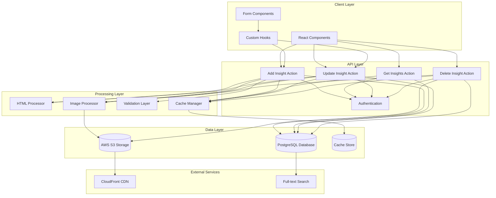
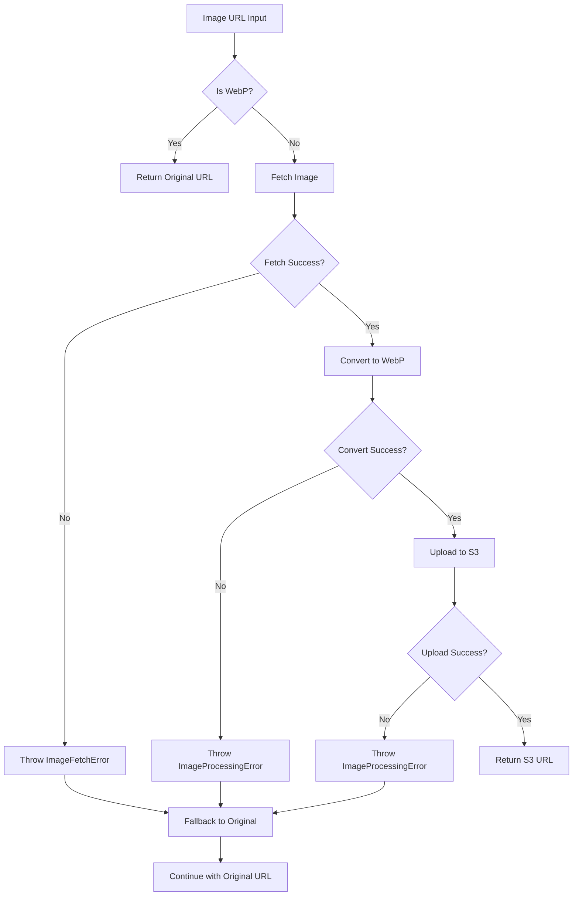
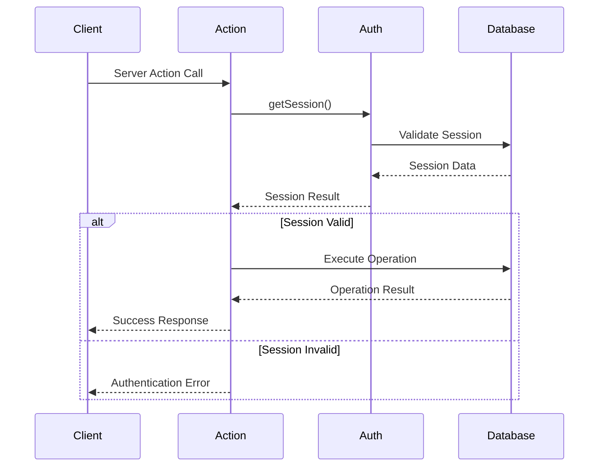
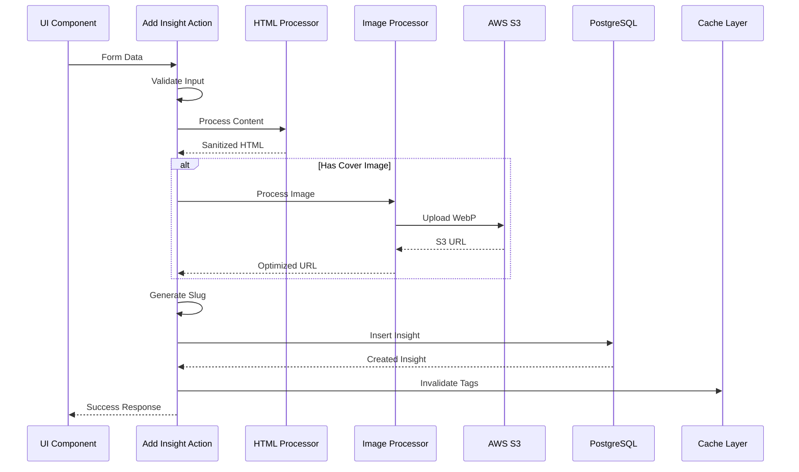
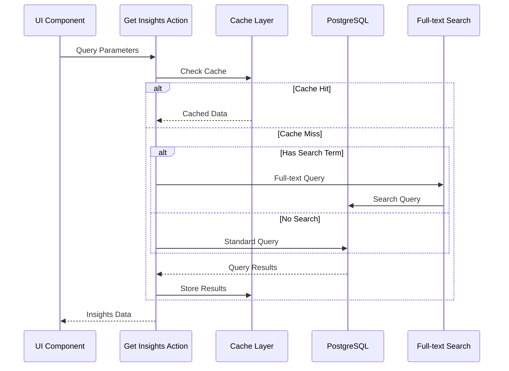
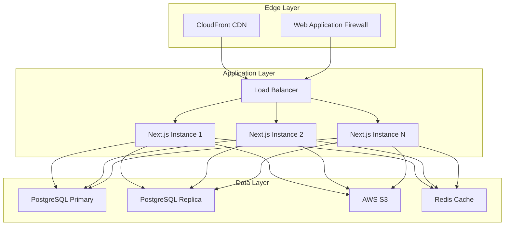

# Insights System Architecture Documentation

## Table of Contents

1. [System Overview](#system-overview)
2. [Architecture Diagram](#architecture-diagram)
3. [Technology Stack](#technology-stack)
4. [Database Schema](#database-schema)
5. [Server Actions Layer](#server-actions-layer)
6. [Image Processing Pipeline](#image-processing-pipeline)
7. [Caching Strategy](#caching-strategy)
8. [Authentication & Security](#authentication--security)
9. [Data Flow](#data-flow)
10. [Performance Optimizations](#performance-optimizations)
11. [Error Handling Strategy](#error-handling-strategy)
12. [Scalability Considerations](#scalability-considerations)
13. [Deployment Architecture](#deployment-architecture)
14. [Monitoring & Observability](#monitoring--observability)

---

## System Overview

The Insights Management System is a comprehensive content management platform built on Next.js 14 with App Router, designed to handle the creation, management, and delivery of insights content. The system emphasizes performance, scalability, and developer experience through modern web technologies and robust architectural patterns.

### Key Features
- **Server-side Actions**: Leverages Next.js server actions for type-safe, secure operations
- **Image Optimization**: Automatic WebP conversion and S3 storage
- **Full-text Search**: PostgreSQL-powered search capabilities
- **Multi-level Caching**: Optimized performance through strategic cache invalidation
- **Type Safety**: End-to-end TypeScript with Drizzle ORM
- **Authentication**: Session-based security with role-based access

---

## Architecture Diagram



---

## Technology Stack

### Frontend
- **Next.js 14**: App Router with React Server Components
- **TypeScript**: End-to-end type safety
- **Tailwind CSS**: Utility-first styling
- **React Hook Form**: Form state management
- **ShadCN/UI**: Component library

### Backend
- **Next.js Server Actions**: Type-safe server operations
- **Drizzle ORM**: Type-safe database operations
- **PostgreSQL**: Primary database with full-text search
- **Sharp**: Image processing library
- **AWS S3**: Object storage for images

### Infrastructure
- **Vercel**: Deployment and hosting
- **CloudFront**: CDN for image delivery
- **Redis**: Caching layer (optional)
- **GitHub Actions**: CI/CD pipeline

---

## Database Schema

### Insights Table Structure

```sql
CREATE TABLE insights (
    id TEXT PRIMARY KEY NOT NULL,
    title TEXT,
    cover_url TEXT,
    author TEXT,                    -- Foreign key to authors
    about_author TEXT,
    community_id TEXT,
    sub_community_id TEXT,
    alt_text TEXT,
    meta_description TEXT,
    meta_title TEXT,
    city_id TEXT,
    developer_id TEXT,
    content TEXT,
    development_id TEXT,
    is_published TEXT,
    is_luxe BOOLEAN DEFAULT false,
    published_at TIMESTAMP WITH TIME ZONE,
    agent_id TEXT,                  -- Foreign key to employees
    slug TEXT NOT NULL UNIQUE,
    updated_at TIMESTAMP WITH TIME ZONE,
    created_at TIMESTAMP WITH TIME ZONE DEFAULT now() NOT NULL
);

-- Indexes for performance
CREATE INDEX idx_insights_slug ON insights(slug);
CREATE INDEX idx_insights_published_at ON insights(published_at);
CREATE INDEX idx_insights_author ON insights(author);
CREATE INDEX idx_insights_is_luxe ON insights(is_luxe);
CREATE INDEX idx_insights_content_search ON insights USING gin(to_tsvector('english', content));
CREATE INDEX idx_insights_title_search ON insights USING gin(to_tsvector('english', title));
```

### Relationships

```typescript
// Drizzle Relations
export const insightRelation = relations(insightTable, ({one}) => ({
    author: one(authorTable, {
        fields: [insightTable.authorId],
        references: [authorTable.id]
    }),
    agent: one(employeeTable, {
        fields: [insightTable.agentId],
        references: [employeeTable.id]
    })
}));
```

### Full-text Search Implementation

```sql
-- Search function for insights
SELECT * FROM insights 
WHERE to_tsvector('english', title || ' ' || COALESCE(content, '')) 
@@ plainto_tsquery('english', $1)
ORDER BY ts_rank(
    to_tsvector('english', title || ' ' || COALESCE(content, '')), 
    plainto_tsquery('english', $1)
) DESC;
```

---

## Server Actions Layer

### Action Structure Pattern

Each server action follows a consistent pattern:

```typescript
/**
 * Standard server action structure
 */
export async function actionName(params: ActionParams): Promise<ActionResponse> {
  try {
    // 1. Authentication validation
    const session = await getSession();
    if (!session) {
      return { success: false, error: "Authentication required" };
    }

    // 2. Input validation
    if (!requiredParam) {
      return { success: false, error: "Validation error message" };
    }

    // 3. Business logic processing
    const processedData = await processBusinessLogic(params);

    // 4. Database operations
    const result = await db.operation(processedData);

    // 5. Cache invalidation
    revalidateTag('relevant-cache-tag');

    // 6. Success response
    return { success: true, data: result };

  } catch (error) {
    // 7. Error handling
    console.error("Action error:", error);
    return { success: false, error: "User-friendly error message" };
  }
}
```

### Action Responsibilities

1. **Add Insight Action**
   - Input validation and sanitization
   - Slug generation from title
   - HTML content processing
   - Image optimization and S3 upload
   - Database insertion
   - Cache invalidation

2. **Get Admin Insights Action**
   - Authentication verification
   - Query parameter processing
   - Full-text search implementation
   - Pagination logic
   - Response formatting

3. **Update Insight Action**
   - Existence verification
   - Partial update handling
   - Conditional image processing
   - Database update with returning clause
   - Selective cache invalidation

4. **Delete Insight Action**
   - Existence verification
   - Database deletion
   - S3 asset cleanup
   - Comprehensive cache invalidation

---

## Image Processing Pipeline

### Processing Flow



### Implementation Details

```typescript
/**
 * Image processing architecture
 */
export async function processInsightImage(
  imageUrl: string, 
  options: WebpConversionOptions = { quality: 80 }
): Promise<string> {
  // Skip processing if already WebP
  if (isWebpImage(imageUrl)) {
    return imageUrl;
  }
  
  // Convert and upload pipeline
  const webpBuffer = await convertToWebp(imageUrl, options);
  const filename = `insight-${createId()}.webp`;
  const directory = 'insights';
  
  return await s3Service.uploadBuffer(webpBuffer, filename, directory);
}
```

### Error Handling Strategy

1. **Graceful Fallbacks**: Image processing failures don't prevent insight operations
2. **Error Classification**: Different error types for specific failure modes
3. **Logging**: Comprehensive logging for debugging and monitoring
4. **Performance**: Skip processing for already optimized images

---

## Caching Strategy

### Cache Layers

1. **Next.js Cache**: Built-in caching for server components and data fetching
2. **Application Cache**: Custom cache tags for fine-grained invalidation
3. **CDN Cache**: CloudFront for static asset delivery
4. **Database Cache**: PostgreSQL query result caching

### Cache Tags Implementation

```typescript
// Cache tag strategy
const CACHE_TAGS = {
  INSIGHTS: 'insights',                    // All insights
  ADMIN_INSIGHTS: 'admin-insights',        // Admin dashboard
  INSIGHTS_LIST: 'insights-list',          // Public list
  INSIGHT_DETAIL: (slug: string) => `insight-${slug}`,  // Individual insights
} as const;

// Cache invalidation patterns
export function invalidateInsightCaches(slug?: string) {
  revalidateTag(CACHE_TAGS.INSIGHTS);
  revalidateTag(CACHE_TAGS.ADMIN_INSIGHTS);
  revalidateTag(CACHE_TAGS.INSIGHTS_LIST);
  
  if (slug) {
    revalidateTag(CACHE_TAGS.INSIGHT_DETAIL(slug));
  }
}
```

### Cache Invalidation Strategy

| Operation | Invalidated Tags | Reason |
|-----------|------------------|---------|
| Create Insight | `insights` | New content affects listings |
| Update Insight | `insights`, `insight-{slug}` | Modified content needs refresh |
| Delete Insight | All tags | Removed content affects all views |
| Bulk Operations | All tags | Multiple changes require full refresh |

---

## Authentication & Security

### Authentication Flow



### Security Measures

1. **Session Validation**: All actions verify valid admin sessions
2. **Input Sanitization**: HTML content is processed and sanitized
3. **SQL Injection Prevention**: Parameterized queries via Drizzle ORM
4. **XSS Protection**: Content sanitization and CSP headers
5. **Error Sanitization**: Internal errors are sanitized for user display

### Access Control

```typescript
// Role-based access control pattern
export async function validateAdminAccess(): Promise<boolean> {
  const session = await getSession();
  return session && session.user.role === 'admin';
}

// Permission checking
export async function hasInsightPermission(
  action: 'create' | 'read' | 'update' | 'delete',
  insightId?: string
): Promise<boolean> {
  const session = await getSession();
  if (!session) return false;
  
  // Implement permission logic based on action and user role
  return checkPermissions(session.user, action, insightId);
}
```

---

## Data Flow

### Create Insight Flow



### Read Insights Flow



---

## Performance Optimizations

### Database Optimizations

1. **Indexing Strategy**
   ```sql
   -- Performance indexes
   CREATE INDEX idx_insights_slug ON insights(slug);
   CREATE INDEX idx_insights_published_at ON insights(published_at);
   CREATE INDEX idx_insights_search ON insights USING gin(to_tsvector('english', title || ' ' || content));
   ```

2. **Query Optimization**
   ```typescript
   // Efficient pagination with total count
   const [insights, totalCount] = await Promise.all([
     db.select().from(insightTable).limit(limit).offset(offset),
     db.select({ count: sql`count(*)` }).from(insightTable)
   ]);
   ```

### Image Optimization

1. **WebP Conversion**: Reduces file sizes by 25-35%
2. **Lazy Processing**: Only process images when URLs change
3. **CDN Integration**: CloudFront for global image delivery
4. **Fallback Strategy**: Continue operations if optimization fails

### Caching Optimizations

1. **Granular Invalidation**: Only invalidate affected cache entries
2. **Cache Warming**: Pre-populate frequently accessed data
3. **Edge Caching**: Leverage CDN for static content
4. **Database Query Caching**: PostgreSQL query result caching

---

## Error Handling Strategy

### Error Classification

```typescript
// Error type hierarchy
export class InsightError extends Error {
  constructor(message: string, public code: string) {
    super(message);
  }
}

export class ValidationError extends InsightError {
  constructor(message: string) {
    super(message, 'VALIDATION_ERROR');
  }
}

export class ImageProcessingError extends InsightError {
  constructor(message: string, public originalError?: unknown) {
    super(message, 'IMAGE_PROCESSING_ERROR');
  }
}

export class DatabaseError extends InsightError {
  constructor(message: string) {
    super(message, 'DATABASE_ERROR');
  }
}
```

### Error Handling Patterns

1. **Graceful Degradation**: Operations continue with fallbacks
2. **User-Friendly Messages**: Internal errors are sanitized
3. **Comprehensive Logging**: All errors are logged for debugging
4. **Retry Mechanisms**: Transient failures are retried automatically

### Error Response Structure

```typescript
interface ErrorResponse {
  success: false;
  error: string;        // User-friendly message
  code?: string;        // Error classification
  details?: unknown;    // Debug information (development only)
}
```

---

## Scalability Considerations

### Horizontal Scaling

1. **Stateless Design**: Server actions are stateless and scalable
2. **Database Connection Pooling**: Efficient connection management
3. **CDN Integration**: Offload static content delivery
4. **Microservice Ready**: Architecture supports service decomposition

### Vertical Scaling

1. **Efficient Queries**: Optimized database operations
2. **Memory Management**: Streaming for large operations
3. **CPU Optimization**: Efficient image processing
4. **Cache Utilization**: Reduce database load

### Future Scalability

1. **Read Replicas**: Database read scaling
2. **Queue Systems**: Async processing for heavy operations
3. **Microservices**: Service decomposition for team scaling
4. **API Gateway**: Centralized request management

---

## Deployment Architecture

### Production Environment



### Environment Configuration

1. **Development**: Single instance with local PostgreSQL
2. **Staging**: Production-like environment for testing
3. **Production**: Multi-instance with database clustering

### Deployment Strategy

1. **Blue-Green Deployment**: Zero-downtime deployments
2. **Database Migrations**: Automated schema updates
3. **Health Checks**: Application and database monitoring
4. **Rollback Procedures**: Quick recovery from failures

---

## Monitoring & Observability

### Logging Strategy

```typescript
// Structured logging implementation
export const logger = {
  info: (message: string, context?: object) => {
    console.log(`ℹ️ ${message}`, context);
  },
  success: (message: string, context?: object) => {
    console.log(`✅ ${message}`, context);
  },
  warning: (message: string, context?: object) => {
    console.warn(`⚠️ ${message}`, context);
  },
  error: (message: string, error?: unknown, context?: object) => {
    console.error(`❌ ${message}`, { error, ...context });
  }
};
```

### Metrics Collection

1. **Application Metrics**
   - Request/response times
   - Error rates
   - Cache hit/miss ratios
   - Image processing success rates

2. **Database Metrics**
   - Query performance
   - Connection pool utilization
   - Full-text search performance
   - Index usage statistics

3. **Infrastructure Metrics**
   - Server resource utilization
   - Network latency
   - S3 upload/download metrics
   - CDN cache performance

### Alerting Strategy

1. **Critical Alerts**: Database failures, authentication issues
2. **Warning Alerts**: High error rates, performance degradation
3. **Info Alerts**: Unusual traffic patterns, cache misses

### Health Checks

```typescript
// Health check endpoint implementation
export async function healthCheck(): Promise<HealthStatus> {
  const checks = await Promise.allSettled([
    checkDatabase(),
    checkS3Connection(),
    checkCacheLayer(),
    checkImageProcessing()
  ]);

  return {
    status: checks.every(check => check.status === 'fulfilled') ? 'healthy' : 'unhealthy',
    checks: checks.map((check, index) => ({
      name: ['database', 's3', 'cache', 'images'][index],
      status: check.status,
      details: check.status === 'fulfilled' ? check.value : check.reason
    }))
  };
}
```

---

## Conclusion

The Insights Management System architecture provides a robust, scalable, and maintainable foundation for content management. Key architectural decisions include:

1. **Server Actions**: Type-safe, secure operations with built-in caching
2. **Image Processing**: Automated optimization with graceful fallbacks
3. **Database Design**: Optimized for search and scalability
4. **Caching Strategy**: Multi-level caching for optimal performance
5. **Error Handling**: Comprehensive error management with user-friendly responses
6. **Security**: Defense-in-depth approach with multiple security layers

This architecture supports current requirements while providing flexibility for future enhancements and scaling needs.
